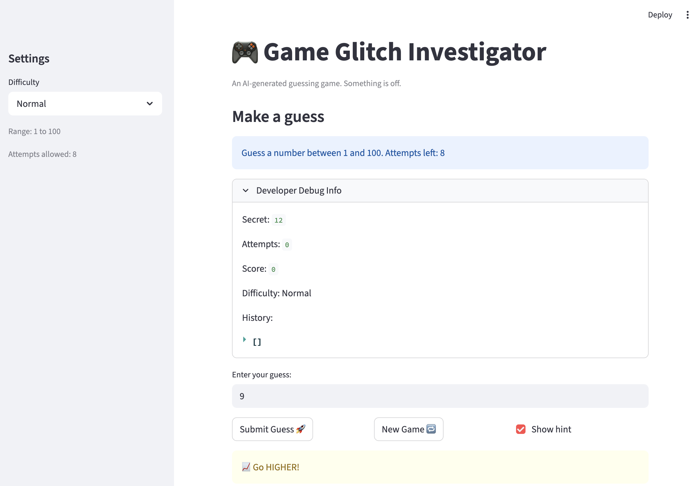

# 🎮 Game Glitch Investigator: The Impossible Guesser

## 🚨 The Situation

You asked an AI to build a simple "Number Guessing Game" using Streamlit.
It wrote the code, ran away, and now the game is unplayable. 

- You can't win.
- The hints lie to you.
- The secret number seems to have commitment issues.

## 🛠️ Setup

1. Install dependencies: `pip install -r requirements.txt`
2. Run the broken app: `python -m streamlit run app.py`

## 🕵️‍♂️ Your Mission

1. **Play the game.** Open the "Developer Debug Info" tab in the app to see the secret number. Try to win.
2. **Find the State Bug.** Why does the secret number change every time you click "Submit"? Ask ChatGPT: *"How do I keep a variable from resetting in Streamlit when I click a button?"*
3. **Fix the Logic.** The hints ("Higher/Lower") are wrong. Fix them.
4. **Refactor & Test.** - Move the logic into `logic_utils.py`.
   - Run `pytest` in your terminal.
   - Keep fixing until all tests pass!

## 📝 Document Your Experience

- [x] **Game Purpose:** Glitchy Guesser is a number guessing game built with Streamlit. The player selects a difficulty (Easy: 1–20, Normal: 1–100, Hard: 1–200) and has a limited number of attempts to guess a randomly chosen secret number. After each guess, the game gives a Higher/Lower hint. The player earns points based on how quickly they guess correctly.

- [x] **Bugs Found:**
  1. Go HIGHER/LOWER hints were swapped — guessing too high told you to go higher, and vice versa.
  2. The secret number reset on every button click because it wasn't stored in `st.session_state`.
  3. On even-numbered attempts, the secret was converted to a string, breaking numeric comparisons.
  4. Hard mode range was 1–50 instead of 1–200, making it easier than Normal mode.
  5. Attempts were initialized to 1 instead of 0, causing an off-by-one error in the display and guess count.
  6. The win score formula had an extra `+1`, inflating the score incorrectly.
  7. The info message hardcoded "1 and 100" instead of showing the actual difficulty range.
  8. New Game used a hardcoded `randint(1, 100)` instead of the selected difficulty's range.
  9. New Game didn't reset `status` or `history`, so the game wasn't actually restartable.

- [x] **Fixes Applied:**
  1. Swapped the return values in `check_guess` so Higher/Lower hints are correct.
  2. Stored the secret number in `st.session_state` on first load so it persists across reruns.
  3. Removed the string conversion of the secret on even attempts in the submit block.
  4. Corrected Hard mode range to 1–200 in `get_range_for_difficulty`.
  5. Initialized `st.session_state.attempts` to 0 instead of 1.
  6. Removed the extra `+1` from the win score formula in `update_score`.
  7. Updated the `st.info` message to use the dynamic `{low}` and `{high}` variables.
  8. Updated New Game to use `random.randint(low, high)` based on the selected difficulty.
  9. Added resets for `status` and `history` in the New Game block.

## 📸 Demo

-   

## 🚀 Stretch Features

- [ ] [If you choose to complete Challenge 4, insert a screenshot of your Enhanced Game UI here]
